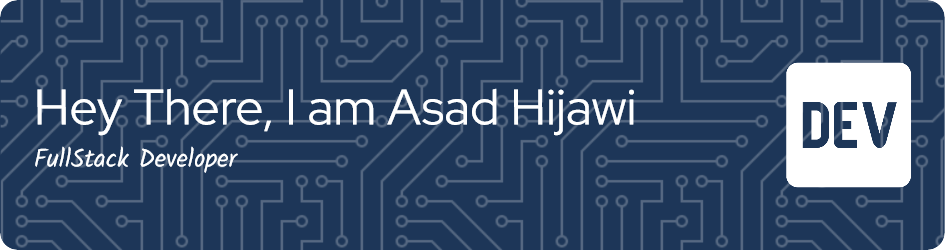

**About Me**

I am an ambitious developer who is currently enrolled in an intense bootcamp to increase my skills and specialize in FullStack Development.
i have knowledge in HTML, CSS , JavaScript, React, Python and Data Bases.
commited to become a full professional and deliever the best results.💻

you can cehck my profiles on :

 
 
 

**Languages And Tools**

<!--
**asadhijj/asadhijj** is a ✨ _special_ ✨ repository because its `README.md` (this file) appears on your GitHub profile.

Here are some ideas to get you started:

- 🔭 I’m currently working on ...
- 🌱 I’m currently learning ...
- 👯 I’m looking to collaborate on ...
- 🤔 I’m looking for help with ...
- 💬 Ask me about ...
- 📫 How to reach me: ...
- 😄 Pronouns: ...
- ⚡ Fun fact: ...
-->
